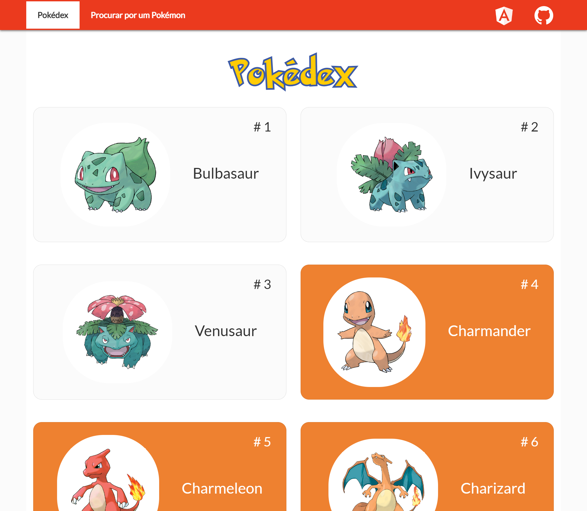
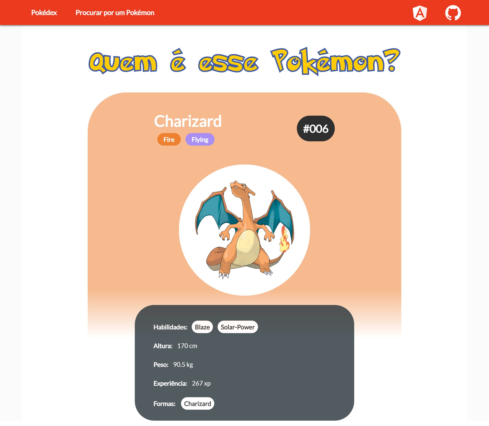

<h1 align="center">AngularDex - FireRed - A Pokédex Built with Angular</h1>
<p align="center">
  
  <br>
  <i>This webApp is an example of an application that can be built with the 
    <br>JavaScript framework Angular.</i>
  <br>
</p>

<p align="center">
  <a href="https://nothingnothings.github.io/AngularDex" target="_blank" rel="noreferrer noopener"><strong>https://nothingnothings.github.io/AngularDex</strong></a>
  <br>
</p>


## Introduction







Single Page Application (SPA) built with the Angular library/framework (ng new project-name). The app's design was inspired by the site [https://pokeapi.co](https://pokeapi.co). Bootstrap, Flexbox, and media queries were used to create a responsive design (attempting to provide the best possible experience across multiple screen configurations/devices, both desktop and mobile, with different resolutions). Following the philosophy of the Angular Framework, the app was structured using features such as modules, components, services, and interceptors.


The app was initialized/bootstrapped with the command/environment `ng new project-name` and deployed with GitHub Pages, assisted by GitHub Actions.


[](https://github.com/nothingnothings/AngularDex)
[](https://github.com/nothingnothings/AngularDex/blob/master/README.pt-br.md)


 
## Technologies
 
Some of the languages and libraries that were used:

- Node Package Manager (bootstrapping and managing the React application)
- HTML5
- SASS (for better organization of CSS rules, nested rules, etc.)
- CSS3 (animations, Flexbox, media queries)
- Angular version 16 (JavaScript framework that proposes the comprehensive structuring of the app in Angular modules, components, services, and interceptors)
- TypeScript (for type safety of objects received from backend endpoints; Models and Interfaces, etc.)
- Angular Router (for navigation between the different "pages" of the application)
- State management (two main states: the central one provided by the "pokedex.service.ts" service, used in the "Pokedex" and "Search for a Pokémon" pages, and the "local" state used on the "PokemonDetails" page, accessed via the route "/pokedex/:idDoPokemon")
- Bootstrap (used for the navigation bar and overall positioning of elements on the page, with "container", "row", and "col")
- Axios (for communication, requests, and responses between this frontend application and the targeted backend, the API endpoints provided by the "pokeapi.co" domain. Used on the "PokemonDetails" page)
- Http Module (used for communication between the Angular application and the targeted backend; seen on the "Pokedex" page)
 
 
## Project Directory Structure

The development environment (created using the tool/environment/workflow `ng new project-name`):


```

.\
│
├── .github\
│   │
│   └── workflows\
│       └── publish.yml
│
│
├── .vscode\
│   ├── extensions.json
│   ├── launch.json
│   └── tasks.json
│
├── snapshots\
│   ├── AngularDex1.png
│   └── AngularDex2.png
│
├── src\
│   │
│   ├── app\
│   │   │
│   │   ├── components\
│   │   │   │
│   │   │   ├── UI\
│   │   │   │   │
│   │   │   │   ├── pokeBall\
│   │   │   │   │   ├── pokeBall.component.html
│   │   │   │   │   ├── pokeBall.component.scss
│   │   │   │   │   └── pokeBall.component.ts
│   │   │   │   │
│   │   │   │   ├── pokedexWrapper\
│   │   │   │   │   ├── pokedexWrapper.component.html
│   │   │   │   │   ├── pokedexWrapper.component.scss
│   │   │   │   │   └── pokedexWrapper.component.ts
│   │   │   │   │
│   │   │   │   ├── spinner\
│   │   │   │   │   ├── spinner.component.html
│   │   │   │   │   └── spinner.component.ts
│   │   │   │   │
│   │   │   │   └── toolbar\
│   │   │   │       │
│   │   │   │       ├── mainNavigation\
│   │   │   │       │   │
│   │   │   │       │   ├── navigationItems\
│   │   │   │       │   │   ├── navigationItems.component.html
│   │   │   │       │   │   ├── navigationItems.component.scss
│   │   │   │       │   │   └── navigationItems.component.ts
│   │   │   │       │   │
│   │   │   │       │   ├── mainNavigation.component.html
│   │   │   │       │   ├── mainNavigation.component.scss
│   │   │   │       │   └── mainNavigation.component.ts
│   │   │   │       │
│   │   │   │       ├── toolbar.component.html
│   │   │   │       ├── toolbar.component.scss
│   │   │   │       └── toolbar.component.ts
│   │   │   │
│   │   │   │
│   │   │   └── errorComponent\
│   │   │       ├── errorComponent.component.html
│   │   │       ├── errorComponent.component.scss
│   │   │       └── errorComponent.component.ts
│   │   │
│   │   │
│   │   ├── interceptors\
│   │   │   └── interceptor.ts
│   │   │
│   │   ├── modules\
│   │   │   ├── pokedex.module.ts
│   │   │   ├── pokemonDetails.module.ts
│   │   │   └── shared.module.ts
│   │   │
│   │   ├── pages\
│   │   │   │
│   │   │   ├── PokedexPage\
│   │   │   │   │
│   │   │   │   ├── pokeSearch\
│   │   │   │   │   ├── pokeSearch.component.html
│   │   │   │   │   └── pokeSearch.component.ts
│   │   │   │   │
│   │   │   │   └── pokedex\
│   │   │   │       │
│   │   │   │       ├── card\
│   │   │   │       │   ├── card.component.html
│   │   │   │       │   ├── card.component.scss
│   │   │   │       │   └── card.component.ts
│   │   │   │       │
│   │   │   │       ├── pokedex.component.html
│   │   │   │       └── pokedex.component.ts
│   │   │   │
│   │   │   │
│   │   │   └── PokemonDetailsPage\
│   │   │       │
│   │   │       ├── pokemonDetailsCard\
│   │   │       │   ├── pokemonDetailsCard.component.html
│   │   │       │   ├── pokemonDetailsCard.component.scss
│   │   │       │   └── pokemonDetailsCard.component.ts
│   │   │       │
│   │   │       ├── pokemonDetails.component.html
│   │   │       └── pokemonDetails.component.ts
│   │   │
│   │   │
│   │   ├── resolvers\
│   │   │   └── pokedex-resolver.service.ts
│   │   │
│   │   ├── services\
│   │   │   ├── loader.service.ts
│   │   │   └── pokedex.service.ts
│   │   │
│   │   ├── types\
│   │   │   ├── navItem.model.ts
│   │   │   ├── pokemon.model.ts
│   │   │   └── simplePokemon.model.ts
│   │   │
│   │   ├── app-routing.module.ts
│   │   ├── app.component.html
│   │   ├── app.component.scss
│   │   ├── app.component.spec.ts
│   │   ├── app.component.ts
│   │   └── app.module.ts
│   │
│   ├── assets\
│   │   │
│   │   ├── fonts\
│   │   │   └── Pokemon Solid.ttf
│   │   │
│   │   ├── images\
│   │   │   ├── angular-logo.png
│   │   │   └── github-logo.png
│   │   │
│   │   └── .gitkeep
│   │
│   ├── environments\
│   │   ├── environment.prod.ts
│   │   └── environment.ts
│   │
│   ├── android-chrome-192x192.png
│   ├── android-chrome-512x512.png
│   ├── apple-touch-icon.png
│   ├── browserconfig.xml
│   ├── favicon-16x16.png
│   ├── favicon-32x32.png
│   ├── favicon.ico
│   ├── index.html
│   ├── main.ts
│   ├── manifest.json
│   ├── mstile-150x150.png
│   ├── site.webmanifest
│   └── styles.scss
│
├── .editorconfig
├── .gitignore
├── LICENSE
├── README.md
├── angular.json
├── package-lock.json
├── package.json
├── tsconfig.app.json
├── tsconfig.json
└── tsconfig.spec.json
```


The production output of `npm run build`, which can be viewed in the `gh-pages` branch (responsible for the app's deployment):


```
.\
│
├── assets\
│   │
│   ├── fonts\
│   │   └── Pokemon Solid.ttf
│   │
│   └── images\
│       ├── angular-logo.png
│       └── github-logo.png
│
│
├── .nojekyll
├── 3rdpartylicenses.txt
├── Pokemon Solid.c76e219434a39b20.ttf
├── favicon.ico
├── index.html
├── main.b4397b76ab87e8f1.js
├── polyfills.fca542ed0eca6182.js
├── runtime.363954a89fca85d6.js
└── styles.4522b103f35ddef3.css
```


## Project Configuration Files (package.json and tsconfig.json)

The package.json file used in the project:

```
{
  "name": "angular-dex",
  "version": "0.0.0",
  "scripts": {
    "ng": "ng",
    "start": "ng serve",
    "build": "ng build --configuration production --base-href https://nothingnothings.github.io/AngularDex/",
    "watch": "ng build --watch --configuration development",
    "test": "ng test"
  },
  "private": true,
  "dependencies": {
    "@angular/animations": "^16.0.0",
    "@angular/common": "^16.0.0",
    "@angular/compiler": "^16.0.0",
    "@angular/core": "^16.0.0",
    "@angular/forms": "^16.0.0",
    "@angular/platform-browser": "^16.0.0",
    "@angular/platform-browser-dynamic": "^16.0.0",
    "@angular/router": "^16.0.0",
    "@types/axios": "^0.14.0",
    "axios": "^1.4.0",
    "rxjs": "~7.8.0",
    "tslib": "^2.3.0",
    "zone.js": "~0.13.0"
  },
  "devDependencies": {
    "@angular-devkit/build-angular": "^16.0.1",
    "@angular/cli": "~16.0.1",
    "@angular/compiler-cli": "^16.0.0",
    "@types/jasmine": "~4.3.0",
    "jasmine-core": "~4.6.0",
    "karma": "~6.4.0",
    "karma-chrome-launcher": "~3.2.0",
    "karma-coverage": "~2.2.0",
    "karma-jasmine": "~5.1.0",
    "karma-jasmine-html-reporter": "~2.0.0",
    "typescript": "~5.0.2"
  }
}


```


The tsconfig.json file used in the project:

```

/* To learn more about this file see: https://angular.io/config/tsconfig. */
{
  "compileOnSave": false,
  "compilerOptions": {
    "baseUrl": "./",
    "outDir": "./dist/out-tsc",
    "forceConsistentCasingInFileNames": true,
    "strict": true,
    "noImplicitOverride": true,
    "noPropertyAccessFromIndexSignature": true,
    "noImplicitReturns": true,
    "noFallthroughCasesInSwitch": true,
    "sourceMap": true,
    "declaration": false,
    "downlevelIteration": true,
    "experimentalDecorators": true,
    "moduleResolution": "node",
    "importHelpers": true,
    "target": "ES2022",
    "module": "ES2022",
    "useDefineForClassFields": false,
    "lib": [
      "ES2022",
      "dom"
    ]
  },
  "angularCompilerOptions": {
    "enableI18nLegacyMessageIdFormat": false,
    "strictInjectionParameters": true,
    "strictInputAccessModifiers": true,
    "strictTemplates": true
  }
}


```

## Installation/Usage


To use this project, clone it using Git:

1. Run `git clone` to clone the project into your local Git repository.
2. Run `npm install` to install all dependencies (`axios`, `angular`, etc.).
3. Run `npm run build` to create the production/deployment version of the application (produced in the `/dist/angular-dex` directory).
4. Serve the production/deployment files locally or on the web (with the help of a hosting service).
5. On the "Pokédex" page, click/tap on the Pokémon whose characteristics you wish to view. On the "Search for a Pokémon" page, type the name of the Pokémon you want to search for.


## Features

- Single Page Application (SPA) with no page reloads, single HTML file (Angular).
- The application is divided into various components, some of which are reused in different pages (design philosophy of the Angular library).
- Design created with CSS (compiled from .scss files).
- Responsive design (adaptive, supporting mobile and desktop devices) created with Bootstrap, Flexbox, and media queries.
- Utilization of GitHub Actions and GitHub Pages with the tool `ng new project-name` to build a seamless workflow (transition from development to production/deployment phase). From the `git push` command, GitHub Actions transfers the contents of the `master` branch to the `gh-pages` branch, which then deploys the app at https://nothingnothings.github.io/AngularDex/.
- Use of the Axios library for communication with the backend "pokeapi.co", providing Pokémon data (names, IDs, weight, height, types, abilities, etc.) to the Vue application.
- Usage of Angular directives such as ``*ngIf``, ``*ngFor``, ``[ngClass]``, and ``[ngStyle]``.
- Usage of Angular features like ``modules``, ``components``, ``services``, and ``interceptors``.
- Custom loading spinner (Pokéball).
- Custom error page with output of the error message/reason to the user.
- Favicon compatible with various devices.

